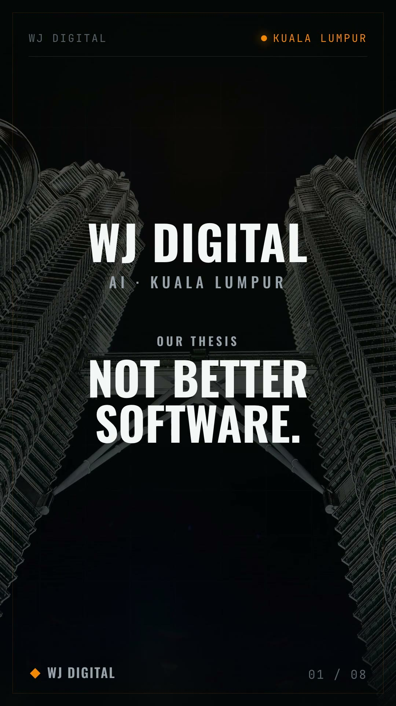
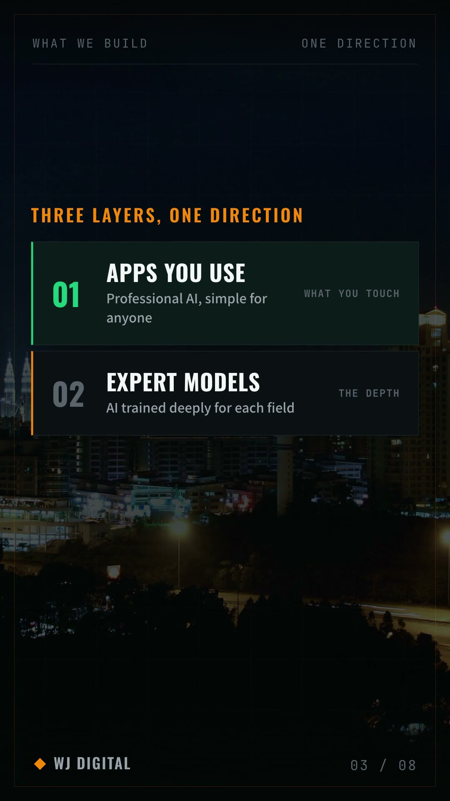

# WayCast

**Turn any company's URL into a polished vertical brand‑film — script, voiceover, city backgrounds, final MP4 — without opening an editor.**

Open‑source · self‑hosted · local‑first. No avatars, no stock‑footage clichés — clean institutional motion‑graphics. The AI agent driving it *is* the writer, so it runs with **zero cloud keys** if you want.

<sub>[中文说明 → README.zh.md](README.zh.md) · MIT OR Apache‑2.0 · Node ≥ 22 · pre‑alpha</sub>



---

## 60‑second try

```bash
npx waycastai doctor                                            # what your machine can do
npx waycastai make https://stripe.com --reuse-bg wjdigital     # URL → brand package in ./brands/
npx waycastai render <slug> --quality standard                 # → ./output/*.mp4
```
Everything lands in *your* folder. Prefer a UI? `npx waycastai console` → http://127.0.0.1:4178.

## What it makes

A 1080×1920, 8‑shot institutional brand film — cover → who‑we‑are → what‑we‑do → why → how → who‑it‑powers → beliefs → CTA — data‑driven from a reusable block library, EN + ZH, real‑voice narration, per‑shot city backgrounds.



## Why WayCast is different

Most "URL → video" tools are paid SaaS, or wrap a cloud API behind talking‑head avatars. WayCast is the opposite end:

| | WayCast |
|---|---|
| **Agent‑native** | Driven by Claude Code / any agent via **MCP** — the agent writes the storyboard itself, so good copy needs **no LLM key** |
| **Local‑first** | Renders locally; bundled local TTS (Kokoro EN / **CosyVoice ZH same‑voice clone**, Apache‑2.0) — or BYO cloud key |
| **Zero‑dependency** | Pure Node + ffmpeg. No framework lock‑in |
| **Style** | Clean text‑motion brand films — **no avatars, no random stock B‑roll** |
| **Bilingual** | English + 简体中文 first‑class (most OSS video tools are EN‑only) |
| **Yours** | Self‑hosted, dual‑licensed, keys stay in your `.env` |

## Three ways to drive it

1. **CLI / npx** — `npx waycastai make <url>` → `render`.
2. **Any coding agent** — clone, point Claude Code at it; it reads [`CLAUDE.md`](CLAUDE.md) and authors + renders the film itself. See [`docs/agent-usage.md`](docs/agent-usage.md).
3. **MCP** — `claude mcp add waycast -- npx waycastai mcp` → 7 tools (`waycast_scrape / write_brand / render / …`). See [`docs/mcp.md`](docs/mcp.md).

## How it works

```
URL ─▶ scrape ─▶ brief (+brand color) ─▶ script (EN/ZH copy) ─▶ pick city images
                                                                      ▼
        brand package (brand.json + storyboard.json + vo.json + bg)
                                                                      ▼
        local TTS  ─▶  retime to narration  ─▶  render (hyperframes)  ─▶  MP4
```
Every stage has a **keyless local/deterministic fallback** and an optional BYO‑key upgrade. Anti‑fabrication is enforced — the copy only uses facts from the site.

## Backends (all optional)

| Capability | Local (offline) | Cloud (BYO‑key) |
|---|---|---|
| Voiceover *(required, pick one)* | Kokoro (EN) / CosyVoice (ZH) | OpenAI / ElevenLabs / Azure |
| Copywriting | deterministic draft **or** the driving agent | Anthropic / OpenAI |
| City images | `--reuse-bg` / drop your own | Pexels / Unsplash |

Keys go in `.env` ([`.env.example`](.env.example)). `npx waycastai doctor` shows what's ready. Full setup: [`docs/install.md`](docs/install.md).

## Status — pre‑alpha (honest)

Core pipeline (URL → standard MP4) is verified end‑to‑end via the local path. Cloud LLM/TTS/image adapters are implemented but not yet live‑tested; a one‑click Docker image for the local models is WIP; Windows is untested (use WSL). It's a self‑hosted dev tool, not a turnkey consumer app. Changelog: [`CHANGELOG.md`](CHANGELOG.md).

## License

Dual‑licensed **MIT OR Apache‑2.0** — your choice. Third‑party components (local TTS models, fonts, CC‑BY sample images, GSAP via CDN) in [`NOTICE`](NOTICE).

## Contributing

Early days — issues and ideas welcome. See [`CONTRIBUTING.md`](CONTRIBUTING.md). If it's useful, a ⭐ helps others find it.
